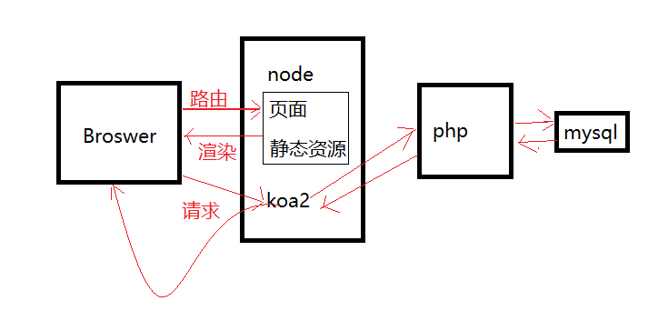
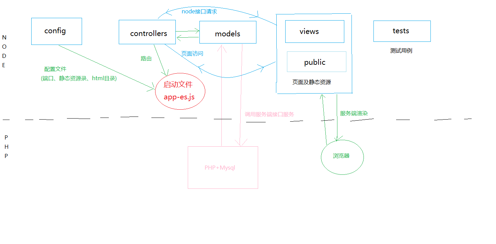

# Node实战
## 基本技术
> node中间层 Koa2+es6+babel+request-promise
> 服务器渲染 h5+css+es6+swig
> 后端服务层 php+mysql
> 自动化测试
> - 单元测试 jasmine+phantomJS
> - 接口测试 Koa2+supertest+Mocha
> - e2e测试  selenium-webdriver+firefox
## 系统交互图

## 架构目录
> - PHP（service）
> - Node

## 启动服务
**记得手动转相关js为Es5**
supervisor app-es.js
## 测试
> - 接口测试: npm run apitest (**编写测试用例，测试前一定要先关闭node服务**)
> ./tests/api.spec.js
> - 单元测试: npm run unittest（**配置karma.conf.js文件**）
> ./tests/util.spec.js
> - e2e测试:  npm run e2etest（**引入相关浏览器的driver.exe可执行文件，配置测试用例**）
> ./tests/e2e.spec.js