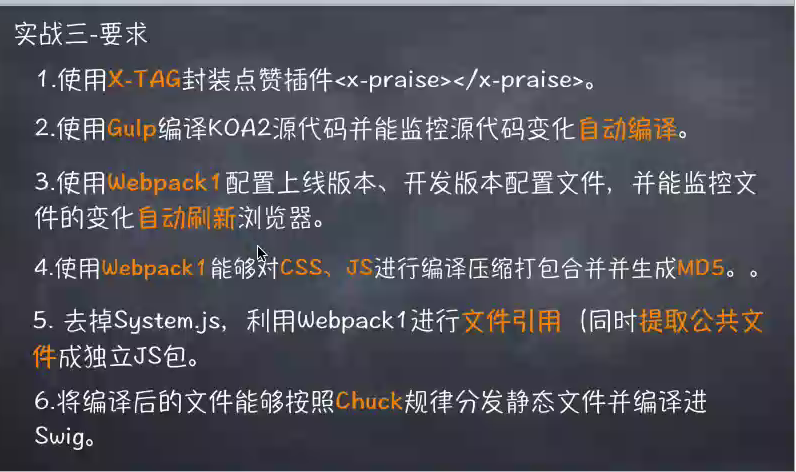
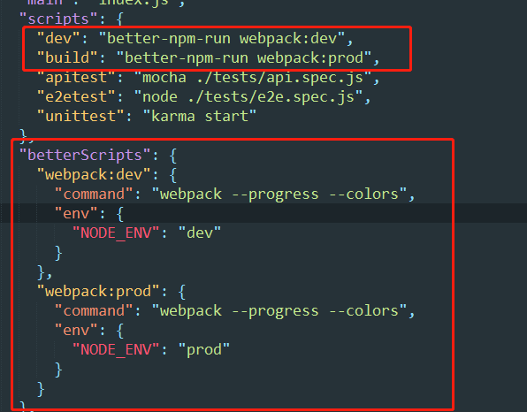

# 项目说明
## 项目要求

> - gulp处理node后端代码
> - webpack打包静态资源等前端代码
## 项目构建
1.gulp处理编译node代码并监控代码变化
> 创建src和build文件夹
> 编写gulpfile.js文件
> 执行 gulp 命令

2.使用webpack配置上线版本及开发版本
> 使用better-npm-run

```
//webpack.config.js
var DevWebpack = require('./config/webpack.dev');
var ProdWebpack = require('./config/webpack.prod');
switch ( process.env.NODE_ENV ) {
    case 'dev':
        module.exports = DevWebpack;
        break;
    case 'prod':
        module.exports = ProdWebpack;
        break;
    default:
        module.exports = DevWebpack;
}
```

3.使用[x-tag](http://x-tag.github.io/)封装插件
```
-----html-----
<script src="http://cdn.bootcss.com/x-tag/1.5.11/x-tag-core.js"></script>
<x-praise></x-praise>
-----tag.es----
var _content = '<div class="hand" id="thumb">' + 
        '<div class="finger"></div>' +
        '<div class="finger"></div>' +
        '<div class="finger"></div>' +
        '<div class="finger"></div>' +
        '<div class="finger thumb"></div>' +
        '<div class="arm"></div>' +
    '</div>' +
    '<span class="hide" id="animation">+1</span>';
xtag.register('x-praise', {
  content: _content,
  lifecycle:{
    created: function(){},
    inserted: function(){},
    removed: function(){},
    attributeChanged: function(){}
  },
  methods: {
    someMethod: function(){}
  },
  events: {
    tap: function(){},
    focus: function(){}
  }
});
```

6.分发
> 设计: 将html -> js -> html 绕个圈回来