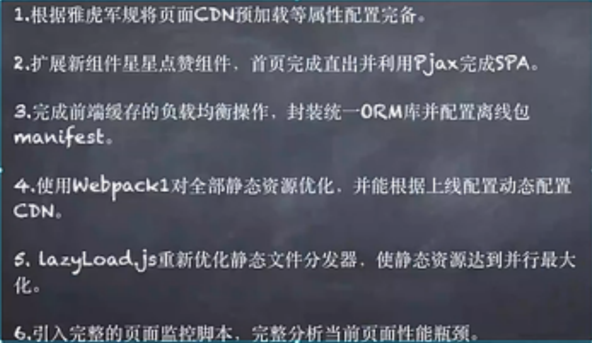
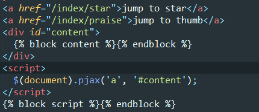
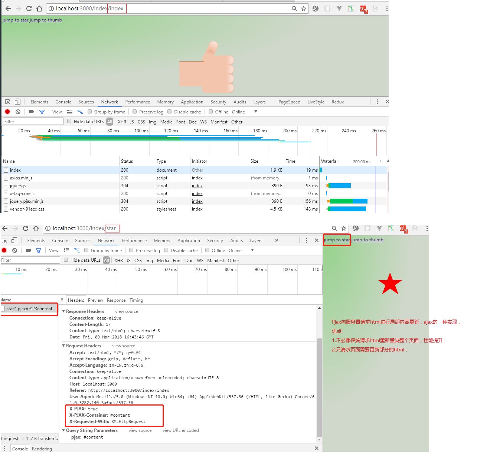
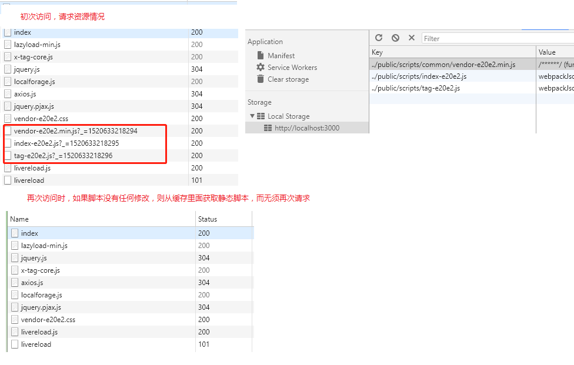
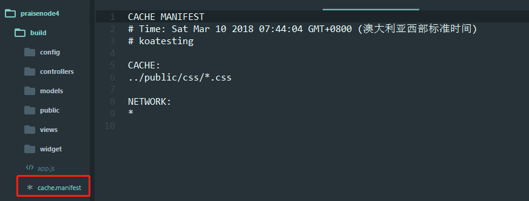

# 项目说明
## 项目要求

> - gulp处理node后端代码并热更新 gulp 
> - webpack打包静态资源等前端代码并热更新 npm run dev
> - supervisor启动node服务，更新代码自动重启服务 cd build -> supervisor app.js

## 项目构建（在作业三的基础上）
1.根据雅虎军规将页面CDN预加载等属性配置完备
```
-------------src/widget/layout.html------------------
//顶部添加
<meta http-equiv="x-dns-prefetch-control" content="on">
//配置link，因为cnd引入的脚本都是http://cdn.bootcss.com的
<link rel="dns-prefetch" href="//cdn.bootcss.com">
<script src="http://cdn.bootcss.com/jquery/3.1.1/jquery.js"></script>
<script src="http://cdn.bootcss.com/axios/0.17.1/axios.min.js"></script>
<script src="http://cdn.bootcss.com/x-tag/1.5.11/x-tag-core.js"></script>
<script src="http://cdn.bootcss.com/jquery.pjax/2.0.1/jquery.pjax.min.js"></script>
```

2.扩展新组件，星星点赞组件，首页完成直出并利用Pjax完成SPA
2.1.星星组件同大拇指点赞一样,注意添加webpack配置
```
---------------src/widget/star.html---------------
<x-star></x-star>
---------------src/public/index.es----------------
class Star extends PraiseButton{
    constructor(){
        super();
    }
}
export {Thumb, Star};
---------------src/public/star.es----------------
import { Star } from './index.es';
const f = new Star();
xtag.register('x-star', {
  //.............
});
```
2.2.配置Pjax

2.3.配置node路由
```
----------------src/controllers/initController.es----------------
//新增
_.get('/index/praise', index.praise());
_.get('/index/star', index.star());
----------------src/controllers/indexController.es---------------
//新增
praise() {
    return async(ctx, next) => {
        ctx.body = '<x-praise></x-praise>';
    }
},
star() {
    return async(ctx, next) => {
      ctx.body = '<x-star></x-star>';
    }
},
```

2.4.处理刷新bug
**注意: 在index/star下，刷新浏览器为空白页了**
```
//因为刷新，请求的还是index/star,所以要修改服务器路由
//判断请求头的标识，来判断是pajx请求还是刷新请求
---------------------------------------
praise(){
        return async(ctx, next) => {
          if(ctx.request.header['x-pjax']) {
              ctx.body = '<x-praise></x-praise>';
          }else{
            ctx.body = await ctx.render('star.html', {
                title: '大拇指点赞'
            });
          }
        };
    },
    star(){
      return async(ctx, next) => {
        if(ctx.request.header['x-pjax']) {
              ctx.body = '<x-star></x-star>';
          }else{
            ctx.body = await ctx.render('star.html', {
                title: '星星点赞'
            });
          }
        };
    },
```

3.完成前端缓存的负载均衡操作，封装统一ORM库并配置离线包manifest
3.1.前端缓存的负载均衡操作
> - 就是将webpack分发的静态资源脚本存储在localStorage中
> - 根据webpack分发的静态资源脚本缓存中是否存在，存在就用缓存的，不存在再请求
```
-----------webAssetsHelp.js----------------
var _scriptsshow = [];
for (var i = 0; i < _regChunk.length; i++) {
    _scriptsshow.push("'" + _files.chunks[_regChunk[i]]['entry'] + "'");
    _scriptsShow.push("'" + _files.chunks[_regChunk[i]]['entry'] + "'");
    //注意一定要加 "'"，开发时就知道了
}
return {
    styles: _styles,
    scriptsshow: _scriptsshow,
    scriptsShow: _scriptsShow
}
-----------src/public/views.js-------------
//这里用了ES6字符串模板，如果要使用ES5字符串拼接，注意最外层一定要使用单引号
//JS拼写用单引号，在编译时，单引号直接输出，双引号会再编译
module.exports = function(templateParams){
  const _cssList = ['vendor'];
  const webAssetsHelp = require('./webAssetsHelp.js')(templateParams, _cssList);
  console.log(webAssetsHelp.scriptsShow);
  let _html = `
    
     {{title}} 
    ${webAssetsHelp.styles}
      
    
    <script>
    (function(){
        //webAssetsHelp.scriptsShow本身是数组，但还要包一层数组，因为在浏览器解析时，会把外层的[]给干掉，一点点试出来的
        var scriptsShow = [${webAssetsHelp.scriptsShow}];
        for(let i=0;i<scriptsShow.length;i++){
            let a=scriptsShow[i];
            if(localStorage.getItem(a)){
              $('<scr'+'ipt>'+localStorage.getItem(a)+'</scr'+'ipt>').attr({type:'text/javascript',id:i}).appendTo($('head'));
            }else{
              localStorage.clear();
              $.getScript({
                    url:a,
                    success:function(data){
                        localStorage.setItem(a,data);
                    } 
                });
            }
          } 
        })()
    </script>
    `;
    return _html;
};
```


3.2. 封装统一ORM库
> - 所谓的ORM库就是离线缓存，前端来讲就是indexDB或websql
> - 使用一个工具库，[localForage](https://segmentfault.com/a/1190000007338055)，来操作indexDB
> - 这里以一个插入广告代码为例，放置在indexDB中
```
一般来说，广告应该是每个页面都应该有的，因此应该放置在layout
-----------------src/wiget/layout.html---------------------------
<script>
localforage.getItem('advertisement',function(err,value){
  if(value == null){
    $.ajax({
      url:'/index/adv',
      success:function(data){
        localforage.setItem('advertisement', data);
        $('body').prepend(data);
      }
    });
  }else{
    $('body').prepend(value)
  }
});
</script>
-------------配置node路由及返回内容-----------------
//返回内容
<div style="height: 150px;background: orange;">。。。。大幅广告。。。。</div>
```
3.3.配置离线包manifest
> - manifest现在很少有公司用了，因为它更新策略有问题，想更新会弹窗询问用户是否要更新，手动点击已经淘汰了，这里只是做为一个技术方案的的备选，练习一下
> - npm i -D webpack-manifest [参考](https://www.npmjs.com/package/webpack-manifest)
> - 这里缓存css吧

3.4. localStorage扩容(扩展)
> - 一个域名下，localStorage大小5M，有时候不够用，需要扩容，需要向服务器的其他域名借点localStorage容量，需要服务器进行相关配置
> - 库 [cross-storage](https://github.com/zendesk/cross-storage)
```
//配置服务器
const Manifest = require('webpack-manifest');
plugins: [
  new Manifest({
    cache: [
        //需要缓存的内容
        '../public/css/*.css'
    ],
    //Add time in comments. 时间戳
    timestamp: true,
    // 生成的文件名字，选填 
    // The generated file name, optional. 
    filename: 'cache.manifest',
    // 注意*星号前面用空格隔开 
    network: [ '*' ],
    // 注意中间用空格隔开 
    // fallback: ['/ /404.html'],
    // manifest 文件中添加注释 
    // Add notes to manifest file. 
    headcomment: "koatesting",
    master: ['../views/layout.html']
  })
]
//服务器配置
Apache
```
运行webpack，发现在build生成了cache.manifest文件


4.使用webpack对全部静态资源优化，并能根据上线配置动态CDN
> - 其实就配置webpack的output的publicPath

5.lazyLoad.js重新优化静态文件分发器，使静态资源达到并行最大化
> - 我们一般使用lazyload来懒加载图片，而这里使用它请求资源并行最大化的功能
> - 比如：a.js,b.js,c.js。串行加载的时间: a+b+c
> - 并行加载的时间就是这三者加载时间最长的那个，节省了很多请求时间
> - lazyload 提供API，进行并行加载
`
LazyLoad.js(['foo.js', 'bar.js', 'baz.js'], function () {
  alert('all files have been loaded');
});
`

```
---------------src/widget/layout.html----------------------
//在请求资源的最前面加上一行
<script src="https://cdn.bootcss.com/lazyload/2.0.3/lazyload-min.js"></script>
---------------src/views/index.js--------------------------
    <script>
    (function(){
      var flag = false;
        var scriptsShow = [${webAssetsHelp.scriptsShow}];
        for(let i=0;i<scriptsShow.length;i++){
            let a=scriptsShow[i];
            if(localStorage.getItem(a)){
              $('<scr'+'ipt>'+localStorage.getItem(a)+'</scr'+'ipt>').attr({type:'text/javascript',id:i}).appendTo($('head'));
            }else{
              localStorage.clear();
                //lazyload方式
                flag = true;
                axios.get(a).then(function(data){localStorage.setItem(a,data.data)});
            }
          }
          if(flag){
            LazyLoad.js(scriptsShow,function(){});
          }
        })()
    </script>
```

6.引入完成的页面监控脚本，完整分析当前页面性能评测
> - performance.timing